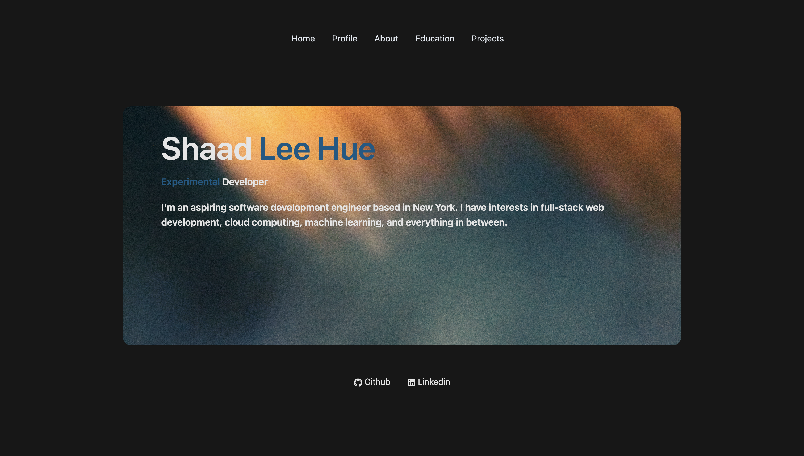

<p align="center" style="font-size: 25px">
💻 - 📱
</p>

<h1 align="center">shaadleehue.com 🫧</h1>
<p align="center">The latest development of <a href="https://shaadleehue.com/" target="_blank">shaadleehue.com</a> built with Next.js  🌸</p>

<p>
    
</p>


## 🌎 Set up 🛠
#
I. Install the dependencies

```bash
$ npm install
or 
$ bun install
```

II. Start the development server

```bash
$ npm run dev
or 
$ bun run dev
```

## 🛫 Build and run production ⚙️
#

```bash
$ npm run build
or 
$ bun run build
```